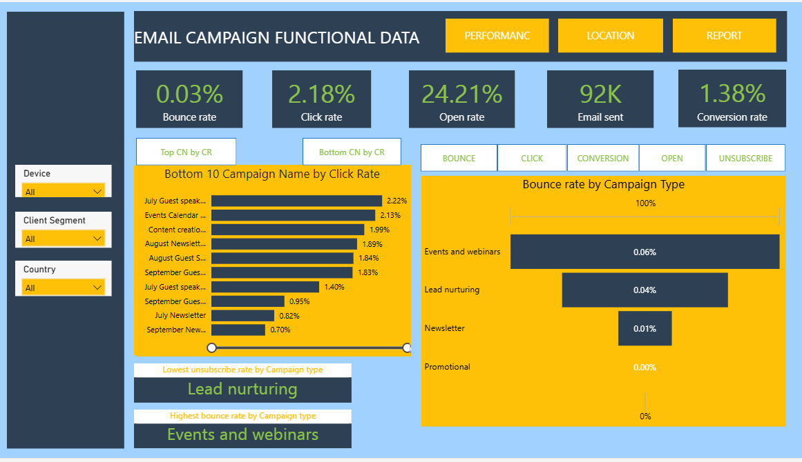
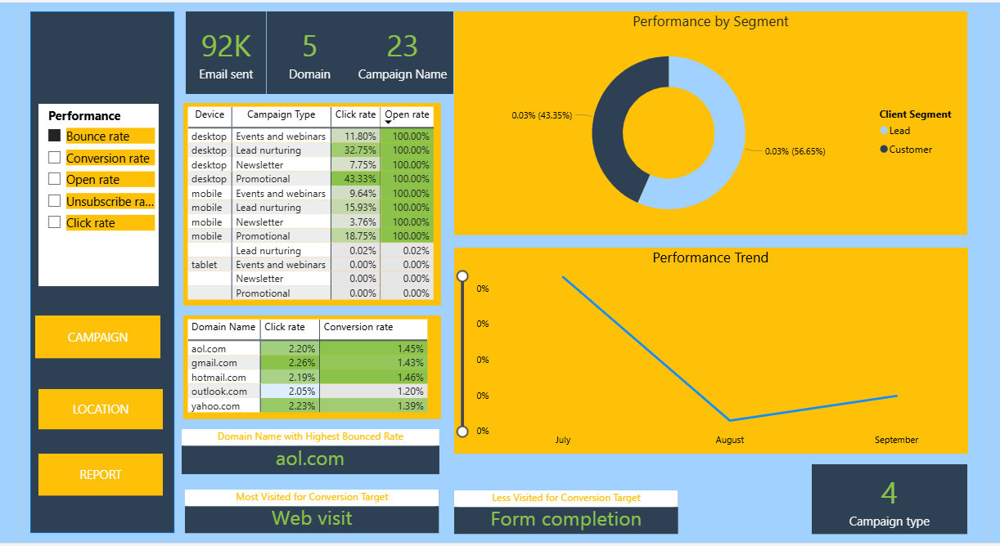
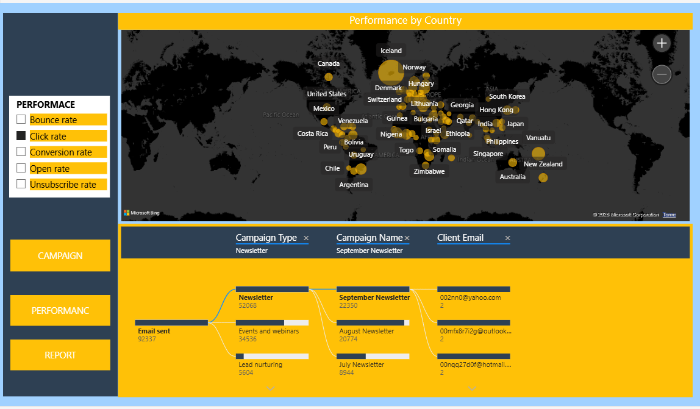

# 📧 Email Campaign Analysis Report

This repository contains an analysis of email campaign performance, engagement metrics,
conversion behavior, geographical insights, and technical recommendations to improve
click-through rates, conversions, and deliverability.

---

**Screenshots:**  
  
  

---

## 📑 Table of Contents
1. [Key Summary](#key-summary)
   - [Overall Campaign Metrics](#overall-campaign-metrics)
   - [Top Performing Campaigns](#top-performing-campaigns)
   - [Underperforming Campaigns](#underperforming-campaigns)
   - [Geographical Insights](#geographical-insights)
   - [Device Usage](#device-usage)
   - [Domain-Level Insights](#domain-level-insights)
2. [Recommendations](#recommendations)
   - [Scale High-Performing Campaigns](#scale-high-performing-campaigns)
   - [Improve Newsletter Engagement](#improve-newsletter-engagement)
   - [Mobile Optimization](#mobile-optimization)
   - [Geographic Targeting](#geographic-targeting)
   - [Deliverability Improvements](#deliverability-improvements)
   - [CTA & Conversion Optimization](#cta--conversion-optimization)

---

## **Key Summary**

### Overall Campaign Metrics
- **Total Emails Sent:** 92,000  
- **Open Rate:** 24.21%  
- **Click-Through Rate (CTR):** 2.18%  
- **Conversion Rate:** 1.38%  
- **Bounce Rate:** 0.03%  

> Deliverability is strong with minimal bounces, but engagement beyond opens can be improved.

---

### Top Performing Campaigns
- **Lead Nurturing**
  - Highest conversion rates
  - Strong mid-funnel performance
- **Events / Webinars**
  - Consistent engagement and conversions
- **Promotional Emails**
  - Highest open rate (**48%**)
  - Indicates effective subject-line strategies

---

### Underperforming Campaigns
- **Newsletters**
  - Example: *September Newsletter*
    - CTR: **0.70%**
  - Suggests content fatigue or weak CTAs

---

### Geographical Insights
- **Highest Conversion Rate:** Iceland  
- **Highest Open Rates:**  
  - Belarus  
  - Iceland  
  - Liberia  
  - Liechtenstein  
- **Lowest Click Rate:** Afghanistan  
- **Highest Bounce Rate:** United Arab Emirates  
- **Highest Unsubscribe Rate:** Kosovo  

---

### Device Usage
- **Desktop**
  - Highest click-through and engagement rates
- **Mobile**
  - Lower CTR than desktop
- **Tablet**
  - Lowest engagement overall

> Indicates the need for improved mobile-first email design.

---

### Domain-Level Insights
- **AOL.com**
  - Elevated bounce rates
  - Low conversion performance
  - Possible list hygiene or deliverability configuration issues

---

## **Recommendations**

<strong>Scale High-Performing Campaigns</strong>

- Increase volume for **Lead Nurturing** and **Events/Webinars**
- Reuse high-performing templates and messaging patterns

<strong>Improve Newsletter Engagement</strong>

- Redesign newsletter layout
- A/B test:
  - Subject lines
  - Content structure
  - CTA placement
- Reduce content density and improve scannability

<strong>Mobile Optimization</strong>

- Implement fully responsive email templates
- Ensure CTAs are:
  - Visible above the fold
  - Touch-friendly
- Optimize font size and spacing for mobile screens

<strong>Geographic Targeting</strong>

- Personalize campaigns for:
  - Iceland
  - Belarus
- Use localized messaging and send-time optimization

<strong>Deliverability Improvements</strong>

- Investigate bounce patterns for **AOL.com**
- Improve list hygiene
- Validate email authentication:
  - SPF
  - DKIM
  - DMARC

<strong>CTA & Conversion Optimization</strong>

- Simplify CTA language
- Reduce friction between email click and landing page
- Test single-CTA vs multi-CTA layouts

---

## 📌 Conclusion
The campaign demonstrates strong deliverability and solid open rates.
Targeted improvements in newsletters, mobile UX, and regional personalization
represent the highest-impact opportunities for increasing CTR and conversions.

---
