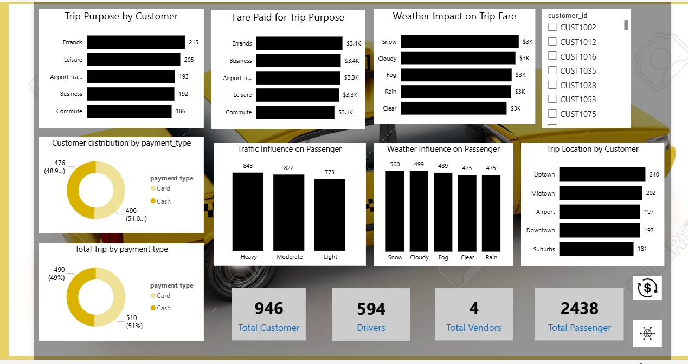

# 🚗 Trip Analysis Report

This repository contains an analysis of trip data, revenue patterns, customer behavior, and recommendations to optimize operations.

---

**Screenshots:**  
  

## 📑 Table of Contents
1. [Key Summary](#key-summary)
   - [Trip Purpose Distribution](#trip-purpose-distribution)
   - [Revenue Insights](#revenue-insights)
   - [Customer Payment Preferences](#customer-payment-preferences)
   - [Weather Impact](#weather-impact-on-revenue-and-trip-duration)
   - [Traffic Influence](#traffic-influence)
   - [Drivers and Vendors](#drivers-and-vendors)
   - [Key Metrics](#key-metrics)
2. [Recommendations](#recommendations)
   - [Revenue Optimization](#revenue-optimization)
   - [Weather-Driven Strategy](#weather-driven-strategy)
   - [Expand Uptown Operations](#expand-uptown-operations)
   - [Enhance Payment Options](#enhance-payment-options)
   - [Driver Efficiency](#driver-efficiency)
   - [Traffic Management](#traffic-management)
   - [Customer-Centric Promotions](#customer-centric-promotions)
   - [Leverage Data for Strategic Decisions](#leverage-data-for-strategic-decisions)

---

## **Key Summary**

### Trip Purpose Distribution
- **Errands:** 215 trips (highest)  
- **Leisure:** 205 trips  
- **Airport Transfers & Business Trips:** Close behind  
- **Commute Trips:** Least frequent  

### Revenue Insights
**By Day of Week:**  
- Highest revenue on **Tuesday**  
- Declines steadily towards Saturday  

**By Hour of Day:**  
- Peak revenue: **mid-day & early evening**  
- Low revenue: **late-night & early morning**  

**By Location:**  
- **Uptown:** $4.0k (highest)  
- **Suburbs:** Lowest revenue  

**By Trip Distance:**  
- Longer trips → higher revenue  

### Customer Payment Preferences
- **Card:** 51%  
- **Cash:** 49%  
- Distribution consistent across metrics  

### Weather Impact on Revenue and Trip Duration
- **Snowy & Cloudy:** Higher revenue, longer trips  
- **Clear:** Lower revenue, shorter trips  

### Traffic Influence
- **Heavy Traffic:** More passengers  
- **Light Traffic:** Fewer passengers  

### Drivers and Vendors
- **Drivers:** 594  
- **Vendors:** 4  
- **Passengers:** 2,438  
- Competitive vendor landscape & reasonable driver-passenger ratio  

### Key Metrics
- **Average Trip Duration:** 5.66 units  
- **Average Price per Trip:** $16.47  
- **Total Revenue:** $19.73k  

---

## **Recommendations**

<strong>Revenue Optimization</strong>

- Focus on **Tuesdays** and **peak hours**  
- Promote **errands & leisure trips** with targeted offers  

<strong>Weather-Driven Strategy</strong>

- Increase pricing or promotion during **snowy & cloudy weather**  
- Prepare drivers for **longer trip durations**  

<strong>Expand Uptown Operations</strong>

- Increase drivers or partnerships in **high-revenue areas**  

<strong>Enhance Payment Options</strong>

- Keep supporting **card & cash**  
- Consider incentives for **card payments**  

<strong>Driver Efficiency</strong>

- Monitor performance during **peak hours** & high-demand locations  

<strong>Traffic Management</strong>

- Educate drivers on traffic trends  
- Provide **navigation tools** for heavy traffic  

<strong>Customer-Centric Promotions</strong>

- Promote services in **suburbs & commute trips** (least frequent)  
- Ideas: ride-sharing discounts, subscription plans  

<strong>Leverage Data for Strategic Decisions</strong>

- Negotiate with vendors  
- Expand in **high-revenue zones**  
- Minimize costs in **low-revenue areas**  

---

## **Tools Used**: PowerBI, DAX, POWER QUERY, MSSQL
